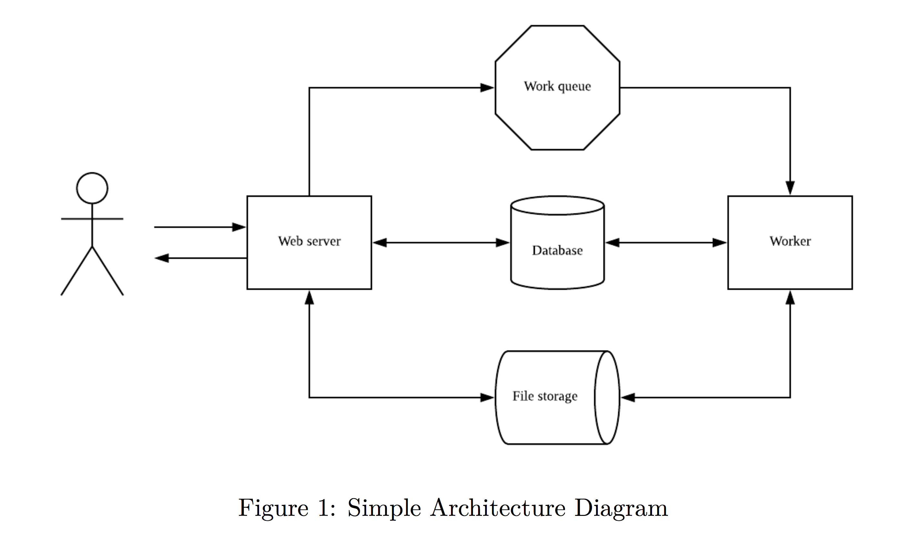

Cogent Labs Image Processing Backend
--

The goal of this project is to create a system where users can submit images to an HTTP endpoint. The images should then be resized in the backend, so that the user can retrieve it later when the resize job is done. Since the server may experience heavy load at times the resize job should be done separately in the backend, so that the web server is freed up to respond to new HTTP requests. The image processing is assumed to be a long running job.

Getting started
--

1. Run the application
- `cd docker/` (from the root of the project)
- `./docker-init.sh && docker-compose up -d && docker-compose logs -f`

NOTE:
- `docker-init.sh` builds all the docker images from the Dockerfiles
- `docker-compose up` starts all containers in the background (api-gateway, image-service, image-processor, redis, rabbitmq)
- `docker-compose logs -f` tails the logs

Implementation
-- 

The project is composed of the following components:
- An API gateway exposing public endpoints to our customers
- An Image Service receives incoming http requests to process images, queues the requests onto a RabbitMQ queue and saves the image id in a Redis datastore
- An Image Processor reads image processing request from a RabbitMQ queue, processes the images into thumbnails, saves the thumbnails in a local storage and updates the Redis datastore with the image processing status
- A RabbitMQ queue where image processing requests are queued
- A Redis datastore to keep track of the processing status of each image
- A local file storage where the original image and the thumbnails are saved

Assumptions
--

- The client of our API gateway is assumed to not support streaming. As a result, the API gateway receives the whole file at once, keeps it into memory and streams it to the Image Service. This can lead to memory issues if clients send large size files or many files at very high rate. Depending on business needs, the allowed image size should be limited and appropriate solution implemented to deal with potential issues.

Design decisions
--

- The API gateway is an additional component from the suggested architecture. The reason for this extra piece is to avoid exposing our internals directly to our customers. The API gateway defines our contract with the outside world and should rarely change. However, the services behind that API could change dramatically in terms of their API. Another scenario could be that the functionalities provided by the API gateway could use multiple services in the future. If a service becomes a performance bottleneck, it should be possible to replace it with a more performant one either by breaking it down to smaller pieces that can be optimized or scaled independently or by changing programming language if all else fails. If the Image Service API was exposed directly to the public, it would be very difficult to make any of these changes.
- The uploaded image is streamed from the API gateway to the image service for performance reason. Ideally, the client should stream the image to the API gateway as well but we assumed a simple client.
- Image Ids are generated using the current high-resolution real time in nanoseconds (`process.hrtime.bigint()`) for simplicity. The probability of conflicting Ids is fairly low.
- Storage path for the original image is passed onto the RabbitMQ messages to avoid coupling between Image Service and Image Processor. This allows changes without requiring changes on both sides.
- Similarly, the resulting thumbnail path is stored in Redis.
- Since the image processing is supposed to be a long running job, the Image Processor updates the Redis status before and after starting the processing of an image so that we can easily investigate where in the pipeline a specific image is at.

Improvements
--
- Depending on business needs, potentially use API keys for authentication of the client. This would allow us to better control the rate of requests to avoid overwhelming the server in case of peak usage or DDOS attacks. This would also allows us to potentially monetize the service.
- Add API versioning to make it possible to introduce breaking changes if needed. Ideally, updating the version of the API should be a last resort solution since it forces current customers to change their current implementations to get new features.
- Better error handling. I feel that there is a lot of room for improvement in my code. The way errors have to be handled in NodeJS and pass down the stack is not always clear to me. 
- Better separation at boundaries. Any communication with the outside world (from the service point of view) should be handled with specific object and converted back and forth with the internal domain object. This prevents outside changes to leak into the entire application. It's actually quite difficult to achieve this with dynamically typed languages. In this specific case where the API handles file uploads, it is also fairly complex to handle changes.
- Use a shared docker volume instead of the host system to store images.
- Configure RabbitMQ for production use. I would have to read more about RabbitMQ to understand what are the important things to look at. Here is a good start: [RabbitMQ Common Errors](https://www.cloudamqp.com/blog/2018-01-19-part4-rabbitmq-13-common-errors.html)
- Add monitoring of all components and custom metrics to measure success/failure rates and response/processing times.
- Load testing. (`scripts/test_sending_images.sh <num-request>` can be used for a very basic/naive load test)
- More tests for corner cases.
- Add build config with travis

Development
--

1. cogentlabs-api-gateway

Run the tests
- `cd cogentlabs-api-gateway` (from the root of the project)
- `npm test` runs the tests inside the test folder

Development
- `npm run clean` runs eslint and prettierjs
- `npm run dev` starts the application (requires image-service, rabbitmq, redis)

2. cogentlabs-image-service

Run the tests
- `cd cogentlabs-image-service` (from the root of the project)
- `npm test` runs the tests inside the test folder

Development
- `npm run clean` runs eslint and prettierjs
- `npm run dev` starts the application (requires rabbitmq and redis)

3. cogentlabs-image-processor

Run the tests
- `cd cogentlabs-image-service` (from the root of the project)
- `npm test` runs the tests inside the test folder

Development
- `npm run clean` runs eslint and prettierjs
- `npm run dev` starts the application (requires rabbitmq and redis)
